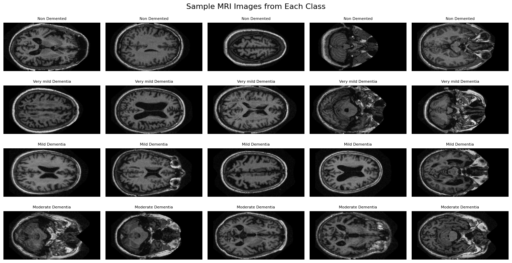
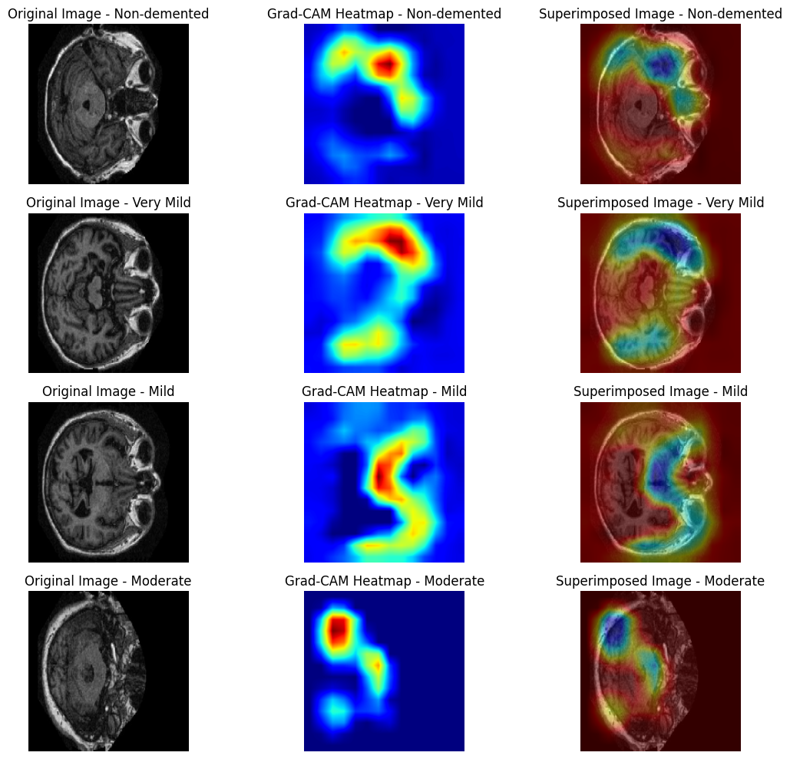

## 📌 Project Title

# 🧠 Lightweight Deep Learning for Alzheimer’s Stage Classification
**Fine-Tuned VGG16 for multi-class classification of Alzheimer’s disease stages using MRI images**

[](https://www.python.org/)
[](https://www.tensorflow.org/)
[](LICENSE)

---

## 📌 Table of Contents
- [Introduction](#introduction)
- [Dataset & Preprocessing](#dataset--preprocessing)
- [Model Architecture & Training](#model-architecture--training)
- [Model Performance & Ablation Study](#model-performance--ablation-study)
- [Grad-CAM Interpretability](#grad-cam-interpretability)
- [Future Work](#future-work)
- [Implementation Details](#implementation-details)
- [Dataset & Acknowledgment](#dataset--acknowledgment)
- [Usage](#usage)

---

## 🧩 Introduction
Alzheimer’s disease (AD) is a progressive neurodegenerative disorder affecting memory, cognition, and behavior. Early detection and staging (Non-Demented → Moderate Dementia) are crucial for timely intervention.  

This project implements a **computationally efficient deep learning pipeline using VGG16** with **transfer learning, fine-tuning, class weighting, and data augmentation** to classify MRI images into four AD stages.

---

## 📂 Dataset & Preprocessing

This study utilized a preprocessed version of the OASIS-1 dataset, containing T1-weighted MRI images for four classes: Non-Demented, Very Mild, Mild, and Moderate Dementia. Images were resized to 224×224 pixels and split into training, validation, and test sets.

## 🧠 Sample Raw MRI Slices from Different Dementia Stages



- **Dataset:** Preprocessed OASIS-1 from Kaggle ([link](https://www.kaggle.com/datasets/ninadaithal/imagesoasis/data))  
- **Images:** ~80,000 T1-weighted MRI slices  
- **Classes:** Non-Demented, Very Mild, Mild, Moderate Dementia  
- **Preprocessing:**  
  - Resize to 224 × 224 pixels  
  - Normalize pixel values [0,1]  
  - Organize into class-specific folders  

- **Data Splitting:** 70% Training | 15% Validation | 15% Testing (stratified)  
- **Data Augmentation (Training only):**  
  - Rotation ±30°, Horizontal/Vertical shift ±20%, Zoom ±20%, Horizontal Flip  
- **Class Balancing:** `compute_class_weight` from Scikit-learn  

---

## 🏗️ Model Architecture & Training
- **Base Model:** VGG16 (`include_top=False`) pre-trained on ImageNet  
- **Custom Layers:**  
  - GlobalAveragePooling2D  
  - Dense(512, ReLU)  
  - Dropout(0.5)  
  - Dense(4, Softmax)  

- **Training Configuration:**  
  - Optimizer: Adam (lr=0.0001)  
  - Loss: Categorical Cross-Entropy  
  - Metrics: Accuracy, Precision, Recall, F1-score  
  - Callbacks: EarlyStopping (patience=10), ReduceLROnPlateau, ModelCheckpoint  

- **Training Strategy:**  
  1. **Frozen Model:** Train top layers only (50 epochs)  
  2. **Fine-Tuned Model:** Unfreeze all layers (70 epochs, smaller lr)  

---

## 📊 Model Performance & Ablation Study

### Comparative Results

| Model | Accuracy | Loss | Key Observation |
|-------|----------|------|----------------|
| Frozen + Augmentation + Class Weights (Baseline) | 73.24% | 0.6864 | Weak minority class performance; Non-Demented dominates |
| Frozen, No Augmentation (with Class Weights) | 72.03% | 0.6973 | Moderate recall high, precision poor; imbalance persists |
| Fine-Tuned + Augmentation + Class Weights ✅ | 98.87% | 0.0310 | Excellent generalization; minority classes recognized |
| Fine-Tuned, No Augmentation (with Class Weights) | 99.99% | 0.0021 | Perfect classification; potential overfitting |

**ROC-AUC:**  
- Fine-tuned models: 1.00 (all classes)  
- Frozen models: >0.80 (Moderate = 0.97)

---

## 🔍 Grad-CAM Interpretability
Grad-CAM highlights class-specific regions influencing predictions.

**Focus regions:** Hippocampus & cortical areas  
**Observation:** Activation becomes more dispersed/intense with advancing AD stages, confirming the model captures meaningful biomarkers.



---

## 🔮 Future Work
- Cross-dataset evaluation (train on one, test on another)  
- Incorporate clinical & demographic metadata  
- Explore EfficientNet or Vision Transformers  
- Apply model ensembling for robustness  
- Enhance interpretability with advanced XAI techniques  

---

## ⚙️ Implementation Details
- **Environment:** Python 3.x, Google Colaboratory Pro, L4 GPU (24 GB VRAM)  
- **Frameworks:** Keras API with TensorFlow backend  
- **Libraries:** NumPy, Matplotlib, Seaborn, Scikit-learn  
- **Preprocessing & Augmentation:** ImageDataGenerator (Keras)

---

## 🗂️ Dataset Source & Acknowledgment
- **Preprocessed Dataset:** [OASIS-1 Kaggle link](https://www.kaggle.com/datasets/ninadaithal/imagesoasis/data)  
- **Original Dataset:** OASIS-1 Cross-Sectional project  
  - Principal Investigators: D. Marcus, R. Buckner, J. Csernansky, J. Morris  
  - Funding: P50 AG05681, P01 AG03991, P01 AG026276, R01 AG021910, P20 MH071616, U24 RR021382  

---

## 🚀 Usage Example
```python
from keras.models import load_model
import numpy as np
from tensorflow.keras.preprocessing import image

# Load model
model = load_model("fine_tuned_vgg16.h5")

# Predict MRI image
img = image.load_img("test_image.jpg", target_size=(224,224))
x = image.img_to_array(img) / 255.0
x = np.expand_dims(x, axis=0)
pred = model.predict(x)
print("Predicted class:", np.argmax(pred))

